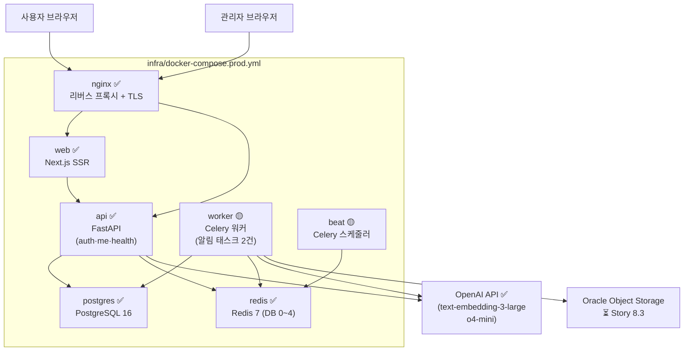

# 아키텍처 개요 (현 구현 + 계획 구분 판)

> **최종 수정일:** 2026-04-24
> **작성자:** Hyung woo
> **승인자:** (인수자 검토 시 기입)
> **버전:** v1.0
> **관련 FR/Story:** NFR-SC3 / Story 9.5a

> **배지 범례**: ✅ 실재 · 🟡 부분 구현 · ⏳ 계획(Story X.Y에서 생성 예정)

---

## §1. 컴포넌트 다이어그램

### Mermaid (GitHub·GitLab 렌더 가능)



### ASCII 병기 (렌더 실패 대비)

```
[사용자/관리자 브라우저]
         │
    [nginx ✅] ─────────────────────────────┐
         │                                  │
    [web ✅]                           [api ✅]
    Next.js SSR                    FastAPI (auth·me·health)
                                         │           │
                              [postgres ✅]   [redis ✅]
                              PostgreSQL 16   Redis 7

[worker 🟡] ──── postgres / redis / OpenAI
[beat 🟡] ────── redis

외부: [OpenAI ✅] · [Oracle Object Storage ⏳ Story 8.3]
```

### 구현 상태 요약 (2026-04-24)

| 컨테이너 | 구현 상태 | 비고 |
|---|---|---|
| `web` | ✅ | Next.js App Router |
| `api` | ✅ | auth·me·health 라우터만 |
| `worker` | 🟡 | `dispatch_queued`·`dispatch_deferred` 2건 실재, 결제 재시도 ⏳ Story 3.4 |
| `beat` | 🟡 | 구조만 실재, 실 스케줄 태스크 ⏳ |
| `postgres` | ✅ | |
| `redis` | ✅ | DB 0~3 active, DB 4 pub/sub ⏳ Story 5.1 |
| `nginx` | ✅ | prod 설정만, dev Nginx 없음 |

---

## §2. 데이터 흐름 4종

### 흐름 ① Q&A 스트리밍 (⏳ Story 2.1·2.2)

```
[브라우저]
    │  POST /api/v1/qa/ask
    ▼
[api: routers/qa.py]          ← ⏳ Story 2.1 생성 예정
    │  answer(query) -> AsyncGenerator
    ▼
[api: rag_integration/]        ← ⏳ Story 2.1
    │  vendor/rag/run_qa.py (lazy init, streaming)
    ▼
[OpenAI API]
    │  ChatOpenAI(streaming=True) token-by-token
    ▼
[api: SSE response]
    │  event: token\ndata: {...}
    ▼
[브라우저: EventSource]
```

### 흐름 ② FAISS 재인덱싱 (⏳ Story 8.3)

```
[관리자]
    │  POST /api/v1/admin/rag/reindex
    ▼
[api: routers/admin_rag.py]    ← ⏳
    │  Celery task enqueue
    ▼
[worker: rag_index_task]       ← ⏳
    │  update_vectorstore.py 실행
    ▼
[FAISS index_a / index_b 교체] ← ⏳ (이중 경로 스왑)
    ▼
[Oracle Object Storage 동기]   ← ⏳
```

### 흐름 ③ 결제 재시도 (⏳ Story 3.4, HOLD-PG 해제 후)

```
[Toss Payments Webhook]
    │  POST /api/v1/payments/webhook
    ▼
[api: routers/payments.py]     ← ⏳
    │  결제 실패 감지
    ▼
[worker: payment_retry_task]   ← ⏳ (eta 재시도)
    │  Toss API 재요청
    ▼
[postgres: payments 테이블]    ← ⏳
```

### 흐름 ④ 외부 연동 (✅/🟡)

```
[브라우저]
    │  GET /api/v1/auth/oauth/{kakao|google|naver}/callback
    ▼
[api: routers/auth.py ✅]
    │  integrations/auth_providers/{kakao|google|naver}.py
    ▼
[OAuth 제공자 API ✅]
    │  access_token → user_info
    ▼
[api: services/auth_service.py ✅]
    │  upsert oauth_identity
    ▼
[worker: notification_tasks.py 🟡]
    │  dispatch_queued / dispatch_deferred (stub only)
    ▼
[integrations/messaging/ 🟡 stub]
```

---

## §3. 9 Epic ↔ 디렉터리 매핑 표

(`architecture.md L1192-1210` 재인용 + 2026-04-24 sprint-status 상태)

| Epic | 주요 디렉터리 | 상태 |
|---|---|---|
| 1. 인증·계정 | `api/src/routers/auth.py`·`api/src/services/auth_service.py`·`api/src/integrations/auth_providers/`·`web/src/features/auth/` | ✅ |
| 2. Q&A RAG | `api/src/rag_integration/`(TBD)·`vendor/rag/`(TBD)·`web/src/features/qa/`(TBD) | ⏳ Story 2.1 |
| 3. 결제·구독 | `api/src/routers/payments.py`(TBD)·`api/src/integrations/pg/`(TBD) | ⏳ Story 3.1 (HOLD-PG 해제) |
| 4. 알림 | `api/src/workers/notification_tasks.py`·`api/src/integrations/messaging/` | 🟡 stub만 |
| 5. 모니터링·감사 | `api/src/middleware/audit.py`(골격)·`api/src/routers/admin_monitor.py`(TBD) | 🟡 Story 5.1 |
| 6. 관리자 계정 | `api/src/routers/admin_users.py`(TBD) | ⏳ Story 6.x |
| 7. 사용자 설정 | `api/src/routers/me.py`(기본)·`web/src/app/`(TBD) | 🟡 |
| 8. 관리자 RAG | `api/src/routers/admin_rag.py`(TBD)·`api/data/faiss/`(TBD) | ⏳ Story 8.1·8.3·8.4 |
| 9. 관리자 재무·핸드오버 | `docs/`·`.github/`·`infra/` | 🟡 Story 9.4 ✅, 9.5a 🟡 |

---

## §4. 핵심 설계 결정 7개

1. **폴리글랏 모노레포** ✅
   - Next.js(`web/`) + FastAPI(`api/`) + Celery(`api/src/workers/`) + Nginx(`infra/nginx/`)를 단일 저장소에서 관리.
   - 근거: 인수자 단일 팀 운영, CI 단일 파이프라인.

2. **FAISS 이중 경로 스왑** ⏳ Story 8.3
   - `api/data/faiss/index_a/`·`index_b/` 두 인덱스를 교대 사용, 재인덱싱 중 서비스 무중단.
   - 현 실재: `api/data/faiss/` 미존재.

3. **Redis DB 0~4 고정 용도** 🟡
   - DB 0: 세션/캐시, DB 1: Celery 브로커, DB 2: Celery 결과, DB 3: 레이트 리밋. DB 0~3 active.
   - DB 4: pub/sub ⏳ Story 5.1.

4. **포트-어댑터 원칙** ✅
   - 외부 연동은 `api/src/integrations/<provider>/` 어댑터 경유. 직통 import 금지.
   - 실재: `integrations/auth_providers/`(Kakao·Google·Naver), `integrations/messaging/`(stub).

5. **snake_case 전파** ✅
   - DB → Python → API JSON → TS 전계층 snake_case. `alias_generator`·camelCase 컨버터 금지.
   - 근거: `api/src/schemas/auth.py:1` 주석 인용.

6. **감사 로그 미들웨어** 🟡
   - `api/src/middleware/audit.py` 골격 실재. NFR-S7 8종 액션 기록 목적.
   - 구체화: ⏳ Story 5.1.

7. **Celery eta 재시도** 🟡
   - `api/src/workers/celery_app.py`·`notification_tasks.py` 실재. 알림 재시도 2건 active.
   - 결제 재시도 태스크: ⏳ Story 3.4.

---

## §5. 수정 허용/금지 표

| 범주 | 허용 | 금지 |
|---|---|---|
| RAG 코드 구조 | 웹 통합 목적 5종(CLI 루프 제거·경로 주입·streaming·lazy init·로깅 확장) | 동의어 정규화·장애인가산 룰·사용자 문구·모델 파라미터(4종) |
| API 응답 | snake_case 키 유지 | camelCase 자동 변환(`alias_generator` 등) |
| 통신 채널 | 알림톡(SMS) 경유 | 이메일 발송 경로 신설 (`smtplib`·SendGrid 금지, `project_email_zero_policy.md`) |
| 일반 코드 | 전 범위 (포트-어댑터·snake_case 원칙 준수 하에) | `integrations/` 직통 import, `routers/` → `models/` 직접 접근 |

상세 정책: [ADR-0002](./adr/0002-rag-integration-contract.md)

---

## 다음에 읽을 문서

- [CODING_CONVENTIONS.md](./CODING_CONVENTIONS.md) — 케이스 규칙·폴더 구조·의존 방향·PR 체크리스트
- [RUNBOOK_RAG.md §0](./RUNBOOK_RAG.md#0-수정-정책) — RAG 수정 정책 요약 (§0만으로 Story 2.1 착수 가능)
- [RUNBOOK_DEPLOY.md](./RUNBOOK_DEPLOY.md) — Oracle VM 배포·CI/CD·롤백·환경변수 전수

> API 레퍼런스(`API_OVERVIEW.md`)와 RAG 통합 상세(`RUNBOOK_RAG.md` §1~§7)는 Story 9.5b 완료 후 추가 예정이다.
